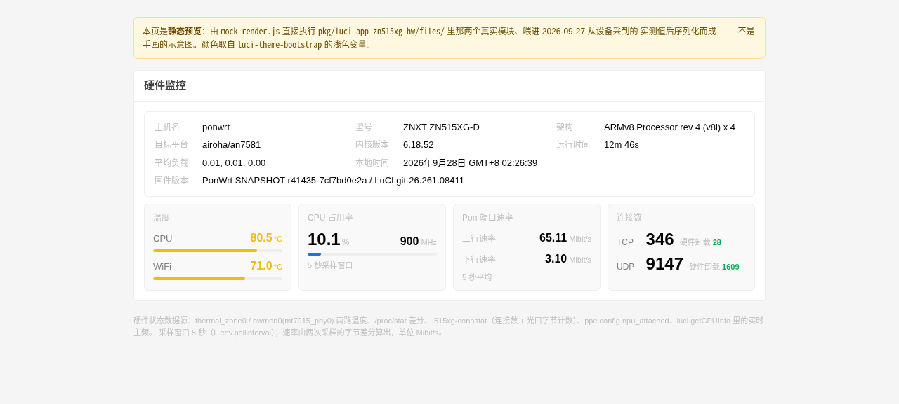

# luci-app-zn515xg-hw

给 **ZNXT ZN515XG-D**（Airoha AN7581，XG-PON 光猫）的 LuCI「状态 → 总览」页面加一个
**硬件监控** 块，替掉默认的「系统」块。



四张卡：**温度**（CPU + WiFi）/ **CPU 占用率**（含实时主频）/ **Pon 端口速率** / **连接数**（含硬件卸载计数）。

<p align="center">
  
</p>

不想刷机、只想知道长什么样：直接用浏览器打开 [`docs/preview.html`](docs/preview.html)
（纯静态页，数据是设备上的实测值，无外部依赖）。

| 项 | 值 |
| --- | --- |
| 包名 | `luci-app-zn515xg-hw` |
| 版本 | `1.0.0-r1` |
| 架构 | **`noarch`**（`PKGARCH:=all`，任何架构都能装） |
| 依赖 | `libc`、`luci-mod-status`、`rpcd`、`rpcd-mod-file` |
| 许可 | GPL-2.0-only |
| 包格式 | apk v3（OpenWrt 24.10+ / ImmortalWrt 快照） |

---

## 编译

把本目录当成一个 OpenWrt 包放进源码树的 `package/` 下即可（仓库根就是包目录）：

```bash
cd <你的 OpenWrt / ImmortalWrt 源码树>
git clone https://github.com/czghzh/luci-app-zn515xg-hw.git package/luci-app-zn515xg-hw

# 选中它：LuCI -> 3. Applications -> luci-app-zn515xg-hw
# 或者直接写配置（=m 只编出 apk，=y 会装进固件）
echo 'CONFIG_PACKAGE_luci-app-zn515xg-hw=m' >> .config

make package/luci-app-zn515xg-hw/compile V=s
```

产物在：

```
bin/packages/<arch>/base/luci-app-zn515xg-hw-1.0.0-r1.apk
```

> ⚠️ **改过 `files/` 里的文件之后，必须先 `clean` 再 `compile`。**
> OpenWrt 的编译 stamp 只把 `Makefile` 当依赖，`files/*` 改了**不会**触发重编 ——
> 直接 `compile` 会"成功"地打出一个装着旧文件的包。反正只有几秒：
>
> ```bash
> make package/luci-app-zn515xg-hw/{clean,compile} V=s
> ```
>
> ⚠️ 改了内容记得动版本号（`PKG_RELEASE` +1）。版本号不变而设备上装着同版本的旧包时，
> `apk add` 可能判定"无变更"而不覆盖。

---

## 安装

```bash
scp luci-app-zn515xg-hw-1.0.0-r1.apk root@<设备>:/tmp/
ssh root@<设备>
```

**装之前确认三件事：**

1. 固件是 apk v3：`apk --version` → `apk-tools 3.x`
2. LuCI 支持运行时目录扫描（否则装了也看不到卡片）：
   `grep -c fs.list /www/luci-static/resources/view/status/index.js` → 必须 ≥ 1
3. 设备确实是 ZN515XG-D：卡片数据源是这个型号专有的（`pon0` 统计、`ppe/config`、
   `mt7915` hwmon）。装到别的机器上**装得上但卡片显示「不可用」**，
   而默认块已经被停用 ⇒ 主页会少一块。

### 方式 A：导入公钥（一次，之后同类包直接装）

```bash
cp public-key.pem /etc/apk/keys/ponwrt.pem      # 用新文件名，不要覆盖现有钥匙
apk add --no-cache /tmp/luci-app-zn515xg-hw-1.0.0-r1.apk
```

### 方式 B：不导入公钥，本次跳过签名校验

```bash
apk add --allow-untrusted /tmp/luci-app-zn515xg-hw-1.0.0-r1.apk
```

* 只在本次生效，下次装同类包还得带参数
* 跳过了签名验证 ⇒ **务必先核对 sha256**（方式 A 由签名本身保证完整性）
* **不要加 `--no-scripts`** —— 停用默认块靠的就是包脚本

> 报 `UNTRUSTED signature`（rc=99）就是这两种方式的分界：说明该设备没预置编这个包的钥匙。
> apk 的信任锚是设备 `/etc/apk/keys/` 里的公钥，**不是**"自签名就能装"那套模型。
> 想不动钥匙目录又保留验签，可以临时凑一个目录（`--keys-dir` 是**替换**而非追加）：
>
> ```bash
> mkdir -p /tmp/k && cp /etc/apk/keys/*.pem /tmp/k/ && cp public-key.pem /tmp/k/
> apk --keys-dir /tmp/k add /tmp/luci-app-zn515xg-hw-1.0.0-r1.apk
> ```

### 装完必做：重新登录一次 LuCI

`rpcd` 只在**每次登录**时读取 ACL 清单，新装的 ACL 对已登录的会话不生效，
不重新登录卡片会报权限错误。之后刷新浏览器即可（JS 是新增文件，不必清 `/tmp/luci-*`）。

### 卸载 = 还原

```bash
apk del luci-app-zn515xg-hw && reboot
```

包脚本会把 `10_system.js.disabled` 改回 `10_system.js`，默认块原样回来。

---

## 它是怎么顶掉默认块的

`view/status/include/10_system.js` 这个路径**属于 `luci-mod-status` 包**，而 apk 不允许
两个包拥有同一个文件。于是：

1. **换文件名绕开** —— 本包装的是 `view/status/include/15_hw.js`。
   LuCI 总览页的 include 列表是**运行时扫目录**得来的
   （`luci-mod-status/.../view/status/index.js`：`fs.list()` → 滤 `\.js$` → `L.require()`），
   所以新文件名会被自动加载，不用去改任何属于别人的文件。
2. **默认块靠包脚本停用** —— `post-install` / `post-upgrade` 把 `10_system.js`
   **改名**成 `10_system.js.disabled`（`.disabled` 不匹配 `\.js$` 过滤器，于是不再渲染，
   而且离还原只差一次改名）；`post-deinstall` 改回来。**不是覆盖** ——
   覆盖会被 `luci-mod-status` 的重装冲掉。

> `title` 必须与默认块的 `System` 不同（本包用「硬件监控」）：include 的 `id` 就是 title，
> 而 LuCI 拿它当 localStorage 里「这个块被隐藏了没有」的 key。沿用旧 title 会**继承旧的隐藏状态**。

---

## 数据源

| 卡片 | 来源 |
| --- | --- |
| 温度（CPU + WiFi） | `/sys/class/thermal/thermal_zone0/temp`、`mt7915` hwmon |
| CPU 占用率 + 实时主频 | `/proc/stat` 相邻两次采样差分、`getCPUInfo` 里的 `(900MHz, …)` |
| Pon 端口速率 | `/sys/class/net/pon0/statistics/{rx,tx}_bytes` 两次采样差分，单位 **Mibit/s**（1024×1024 bit/s） |
| 连接数（含卸载标记） | `/proc/net/nf_conntrack` 计数 + `[HW_OFFLOAD]` 标记 |
| 硬件卸载是否生效 | `/sys/kernel/debug/ppe/config` 的 `npu_attached` |

一次性读全部数据的 helper 是 `/usr/sbin/515xg-connstat`（连接数和光口字节共用一次 exec，
不会把 `nf_conntrack` 扫两遍）。ACL 在 `files/luci-status-hardware.json`。

速率卡里**上行在上、下行在下**，单位 Mibit/s，**不显示接口名**（页面上找不到 `pon0` 字样）。

---

## 已知现象（都不是故障）

* **「Pon 端口速率」显示 0** —— 这张卡读的是 PON 光口字节数。设备没插光纤 / PON 没起来
  （例如 WAN 走的是以太网口 + PPPoE）时速率就是 0。
* **「硬件卸载」显示待命** —— `npu_attached` 是**懒挂载**（唯一赋值点在有流卸载时触发），
  没有卸载流的时候它就是 0，有流量后自动变化，不是功能坏了。
* 温度 / CPU 占用率 / 连接数三项只依赖 `/sys/class/thermal`、`/proc/stat`、
  `/proc/net/nf_conntrack`，任何 OpenWrt 设备都有；**只有速率卡和卸载标记是这型号专有的**。

---

## 许可

GPL-2.0-only，见 [LICENSE](LICENSE)。
